<!--
  ============================================================================
  RACHIT PANDEY — GitHub profile README
  Handle: its-skark   ·   Repo: its-skark/its-skark
  ============================================================================

  WHY TABLE CELLS ARE PURE HTML
  ------------------------------
  Inside a <td>, GFM markdown parsing is inconsistent: a blank line after the
  opening tag starts a markdown block, but an indented closing tag can then be
  swallowed into an indented-code-block and render as literal `</td>`. Verified
  against https://api.github.com/markdown (GitHub's own renderer).

  So: markdown is used freely OUTSIDE tables (headings, lists, paragraphs), and
  every table cell is written in plain HTML (<h3>, 
, <ul>, <li>, <b>). That
  is deterministic on every renderer and is what the community templates do.

  WHAT GITHUB ALLOWS (verified allowlist)
  --------------------------------------
  Kept:      h1-h6, p, div, span, a, img, picture, source, br, b, strong, em,
             i, small, sub, sup, kbd, abbr, table, thead, tbody, tr, td, th,
             details, summary, blockquote, hr, code, pre, ul, ol, li, dl, dt, dd
  Removed:   iframe, style, script, link, class, style="", object, embed, svg,
             form, and every data: URI. `target` is also stripped.
  Kept attrs: align, width, valign, colspan, open, src, href, alt.

  Consequently there are exactly two visual tools:
    1. layout  -> <table>, 
, 

    2. artwork -> . SVG loaded through  keeps its
       CSS @keyframes, SMIL <animate>, gradients and <filter> blurs, which is
       why every decorative element here is a self-hosted SVG.

  NO third-party card services are used for the visuals: github-profile-trophy
  and github-readme-activity-graph both return HTTP 402 (deployments disabled),
  readme-typing-svg's public endpoints now return an HTML demo page instead of
  an SVG, and githack/jsDelivr cannot deliver HTML to a README because iframes
  are stripped. Self-hosted SVG means the design cannot break.

  Regenerate the artwork after editing the generators:
      python3 tools/gen_cards.py assets
      python3 tools/gen_typing_svg.py assets
  Check the README before pushing:
      python3 tools/lint_readme.py
      python3 tools/check_images.py
      python3 tools/preview_readme.py
-->

  

  

  

  
  
  
  
  

## About me

I build **production web systems** — the kind with tenants, migrations, payment
webhooks, role-based access and a support ticket that says *"it works on my
machine"*. My day job is Angular front-ends and Node/Express services behind
multi-tenant POS products used by real restaurants, hotels and laundries.

On the side I work on **AI-assisted developer tooling**: an engine that parses
repositories with `tree-sitter`, runs `semgrep` rules and scores engineering
practice so recruiters can screen beyond a CV. I've also compiled and maintained
a custom **Linux kernel** for a Poco device — a very different flavour of *"it
won't boot"*.

I like boring, well-named code: explicit schemas over clever inference, boring
infrastructure over heroics, and documentation that survives the next sprint.

<b>More about my focus</b>

- <b>Production SaaS</b> — multi-tenant POS suites, booking &amp; billing flows, offline-tolerant front-ends, admin consoles
- <b>AI &amp; code intelligence</b> — tree-sitter multi-language AST parsing, semgrep static analysis, MCP tooling, AWS Bedrock prompt/context design
- <b>Cloud &amp; DevOps</b> — EC2 + S3 + DynamoDB, Nginx reverse proxies, Docker builds, Stripe/Razorpay webhooks, Zod validation
- <b>Interface craft</b> — Angular + PrimeNG and React + Tailwind screens that stay fast, accessible and consistent under load

<b>What I use daily</b>

<b>Currently reading / thinking about</b>

- Multi-tenant Postgres schema design — RLS, tenant isolation, zero-downtime migrations
- Making AI evaluation measurable instead of vibes-based
- Angular signals vs. the rest of the ecosystem
- Why "just add a cache" is never the fix

## Featured work

<table>
<tr>
<td width="50%" valign="top">

<h3>SkillFlow — AI-powered technical hiring</h3>

My B.Tech major project. A hiring platform that evaluates candidates on
<b>repository intelligence</b> instead of resume keywords: candidates submit their
strongest repos, and the engine parses them, scores engineering practice and
drives the recruiter's pipeline from there.

<ul>
<li><b>tree-sitter AST parsing</b> for C, Go, Java, JavaScript, Python, Ruby, Rust and TypeScript — real structure, not regex</li>
<li><b>FastAPI service</b> with Pydantic schemas, OpenTelemetry tracing and an MCP server for agent tooling</li>
<li><b>Configurable funnels</b>: stage transitions, automation rules, ATS filtering, assessment scheduling and manual review</li>
<li><b>semgrep static analysis</b> plus weighted scoring across complexity, activity and language mix</li>
</ul>

</td>
<td width="50%" valign="top">

<h3>Restaurant · Hotel · Laundry POS</h3>

A multi-tenant POS platform family: order and billing flows, kitchen / barcode /
QR printing, subscriptions, org-level settings, and an Express API split into
focused services (users, bookings, organisations, settings, customers) on
PostgreSQL. Built with <b>Angular 20</b> + PrimeNG + Tailwind on the front,
Express + PostgreSQL behind it, in Docker.

Professional work — private repository.

<h3>SVSP policy &amp; impact portal</h3>

Multi-language member portal for a policy organisation: membership payments,
encrypted document handling, receipt and PDF generation, analytics dashboards and
a full OpenAPI contract.

</td>
</tr>
</table>

<table>
<tr>
<td width="50%" valign="top">

<h3>Tenant storefront engine</h3>

Multi-tenant storefront toolkit with a DSL verifier, JWT auth and Redis caching —
plus a small <b>island-hydration SSR framework</b> I wrote to keep client JS small.

<h3>SreeIyer e-commerce platform</h3>

Storefront and admin for a digital commerce platform: Stripe checkout, realtime
order socket, cloud object storage, ebook and document processing pipeline.

</td>
<td width="50%" valign="top">

<h3>LineageOS 21 custom kernel</h3>

Custom kernel 4.14.336 with KernelSU modifications, built and flashed for the
Poco M2 Pro — a reminder that not every bug lives in TypeScript.

<h3>Tools &amp; experiments</h3>

<b>LucarioBot</b> — alert bot for Discord (Hikari). <b>LeadsGenerator</b> —
Python scraping utilities. <b>voxelEngine</b>, <b>router-cli</b> (Go) and
<b>LinuxSyncVolume</b> shell automation, plus a personal site and a remote-meeting UI.

<a href="https://github.com/its-skark?tab=repositories">see all repositories →</a>

</td>
</tr>
</table>

## Experience

<table>
<tr>
<td valign="top" width="24%"><b>Bilwg Services Pvt. Ltd.</b> May 2026 → Present · Remote</td>
<td valign="top">
<b>Software Developer</b> — full-stack product engineering
<ul>
<li>Building and maintaining <b>Angular</b> front-end features for client-facing SaaS products, pairing with senior engineers on feature design and delivery.</li>
<li>Implementing <b>full-stack features in React and Express</b> across REST APIs, auth and data layers used by real customers.</li>
<li>Contributing to code reviews, debugging, testing and deployments.</li>
</ul>
</td>
</tr>
<tr>
<td valign="top"><b>Delosch Technologies Pvt. Ltd.</b> Jun 2025 → Aug 2025 · Hybrid</td>
<td valign="top">
<b>Full-Stack &amp; AI Engineering Intern</b>
<ul>
<li><b>AI automation:</b> engineered custom contexts and tuned prompt designs on <b>AWS Bedrock</b> to automate HR workflows and cut manual processing.</li>
<li><b>Full-stack:</b> shipped responsive Remix.js + React surfaces focused on cross-device performance.</li>
<li><b>Cloud:</b> integrated <b>S3</b> for scalable file storage and <b>DynamoDB</b> for high-performance NoSQL access.</li>
<li><b>DevOps:</b> stood up <b>EC2</b> instances, backend services and <b>Nginx reverse proxies</b>.</li>
</ul>
</td>
</tr>
<tr>
<td valign="top"><b>SCPPS</b> 2022 → 2024 · Pantnagar</td>
<td valign="top">
<b>Technical Committee Lead</b>
<ul>
<li>Architected and deployed the society's official blog and digital infrastructure.</li>
<li>Led a cross-functional team running web infrastructure for events with <b>500+ attendees</b>.</li>
<li>Set up the society's payments, member portal and document tooling.</li>
</ul>
</td>
</tr>
</table>

## Education

**B.Tech, Information Technology** — Govind Ballabh Pant University of Agriculture and Technology, 2022 → 2026

Graduated June 2026. SkillFlow, above, was my major final-year project.

**XII (ISC)** — St. Mary's Convent Inter College, 2022

## GitHub activity

  

  
  
  

<b>Notes on the stats above</b>

- <b>Top languages</b> counts only <i>public</i> repository bytes. Most of my professional TypeScript/Angular/Express work lives in private repositories at my employer, so it understates TypeScript badly. The stack cards above are the accurate picture.
- The repo count and follower badges are live queries. shields.io's `github/repos`, `/contributors` and `/last-commit` endpoints are currently returning "badge not found" for every user, so those three were replaced with values verified against the API.
- The stats, streak and snake images are the only parts that depend on something outside this repository. Every other visual is a self-hosted SVG in `assets/`, so if those fail the page still looks finished.

## Let's connect

  
  
  
  

  Open to <b>full-stack</b>, <b>product</b> and <b>AI engineering</b> roles —
  and always happy to talk architecture, POS systems, code intelligence or
  custom kernels.

  

  Designed and built with HTML, CSS and stubborn curiosity ·
  <a href="https://github.com/its-skark/its-skark">source on GitHub</a>

